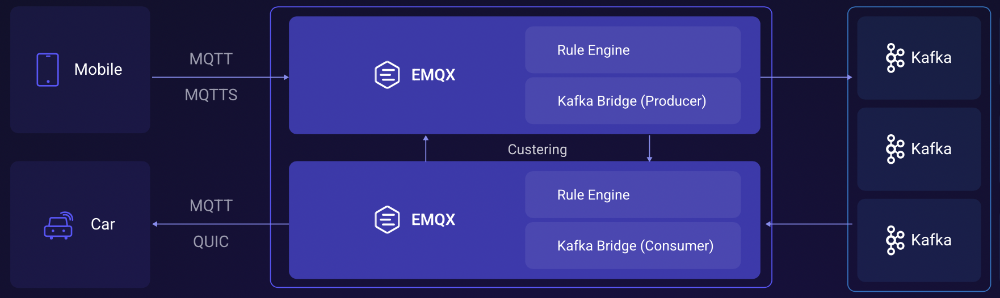
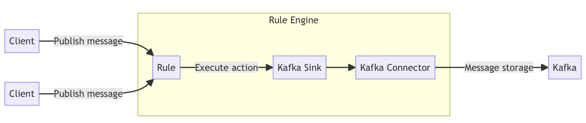
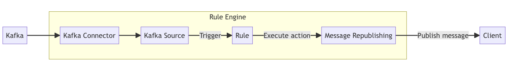

# Getting Started

### EMQX, KAFKA
  ```
  docker-compose up -d
  ```
[EMQX Dashboard](http://localhost:18083)

### MQTTX messages:
  ```
  docker logs -f mqttx
  ```

### KAFKA messages:
  ```
  docker exec -it kafka-kraft \
  kafka-console-consumer \
  --topic sinc_topic \
  --from-beginning \
  --bootstrap-server localhost:9092
  ```  

### How It Works
Streaming data into and out of Apache Kafka needs to create a Kafka Sink (to send messages to Kafka) and 
a Kafka Source (to receive messages from Kafka), respectively. Take the Sink as an example, the flow is as follows:

1. Message publication and reception: IoT devices on connected vehicles establish successful connections to EMQX 
through the MQTT protocol and periodically publish messages containing status data via MQTT. 
When EMQX receives these messages, it initiates the matching process within its rules engine.
2. Message data processing: With an embedded rule engine working together with the broker as a single component, 
these MQTT messages can be processed based on topic-matching rules. 
When a message arrives, it passes through the rule engine, which evaluates the defined rules for that message. 
If any rules specify payload transformations, those transformations are applied, such as converting data formats, 
filtering out specific information, or enriching the payload with additional context.
3. Bridging to Kafka: The rule defined in the rule engine triggers the action of forwarding the messages to Kafka. 
Using the Kafka bridging functionality, MQTT topics are mapped to pre-defined Kafka topics, and 
all processed messages and data are written into Kafka topics.


Sink

Source



